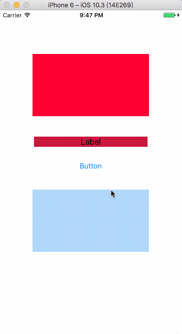

# UIControl_TouchBlock_Runtimer
## 预览


## 介绍
开始的时候只是为了测试利用Runtimer给UIControl动态添加几个回调属性。

后来项目开发的时候发现经常有些lable或者view需要添加点击事件，这样一来就在原有的基础上进行了扩展。

将UIControl，UIButton, UILable, UIView 都进行了扩展。


## 安装 
将项目中对应的Category文件拷到自己的工程中即可。
## 使用 
- UIControl

```
    self.testControl.touchUpBlock = ^(id sender){
        NSLog(@"%@",sender);
    };
```    
- UIButton

```
    [self.buttonTouch addButtonTouchBlock:^(id sender) {
        NSLog(@"%@",sender);
    }];
```    
- UILable

```
    [self.uiLable addUILableTouchBlock:^(id sender) {
        NSLog(@"%@",sender);
    }];
```    
- UIView

```
    [self.viewTouch addUIViewTouchBlock:^(id sender) {
        NSLog(@"%@" , sender);
    }];


